<style>img, pre { box-shadow: 0px 1px 1px 1px rgba(100,100,100,0.2);</style>

# Building a Store Locator with React Native

Today we will be walking through building a Store Locator app using React Native, and Stamplay's geolocation queries.

The app will feature user accounts, the ability to search within a radius for locations near them, and select a store where they will be able to request directions.

First we will need to setup our enviornment to develop React Native applications.

### Setting Up The Enviornment

The best way to get your dev enviornment setup for React Native is to follow the guide in the documentation, which can be found here, http://facebook.github.io/react-native/docs/getting-started.html#installation.

Another tool to install, is [React Native Package Manager](https://github.com/rnpm/rnpm). This will allow you to easily link npm dependencies to native SDKs. We will use this verus manually adding the links to the IOS project files.

### Setting Up The Project

After installing the recommended tools, create a new React Native project by running:

```bash
react-native init StoreLocator
```

Next `cd` into your new project and run:

```bash
npm i -S axios react-native@0.24.0 react-native-{button,geocoder,maps,router-flux} redux react-redux redux-thunk
```

Now link your dependencies with **React Native Package Mangager**:

```
rnpm link
```

Our `package.json`:

```json
{
  "name": "StoreLocator",
  "version": "0.0.1",
  "scripts": {
    "start": "node node_modules/react-native/local-cli/cli.js start"
  },
  "dependencies": {
    "axios": "^0.11.0",
    "react": "^0.14.8",
    "react-native": "^0.24.0",
    "react-native-button": "^1.5.0",
    "react-native-geocoder": "^0.3.1",
    "react-native-maps": "^0.3.2",
    "react-native-router-flux": "^3.22.23",
    "react-redux": "^4.4.5",
    "redux": "^3.5.2",
    "redux-thunk": "^2.1.0"
  }
}

```

Now we can add a new folder `app` to your project, and the follow subfolders:

```
app
	actions
	api
	components
	config
	reducers
	stores
```

Now we can get started on development of our StoreLocator native app.

### Getting Started

The first thing we will want to do is build the initial project, and inspect the `index.ios.js` file setup.

To run the project on ios run:

```bash
react-native run-ios
```

You may also open `ios/StoreLocator.xcodeproj` in **Xcode** and build an run the project on an IOS emulator.

After running the project, we land on the initial screen of the default project app.

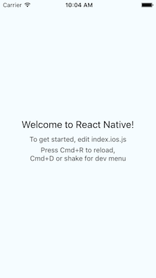

Next let's look at the `index.ios.js` to see how the root our IOS project is setup.

At the top we have a collection of imports from `'react'` and `'react-native'`.

As of `'react-native@0.25.1'` requiring the `React API` from `'react-native'` is being deprecated.

If you have `react-native@0.25.x` installed, you will get a warning from `react-native-router-flux` telling you it is deprecated, ensure you have version `0.24.0` installed of `react-native` to use the `react-native-router-flux`.

A fix will be in the upcoming new release of `react-native-router-flux`, but until use the specified `react-native` version.

Other than the `AppRegistry` the code inside our `index.ios.js` is a fairly classical React Component so we will focus on the purpose `AppRegistry`.

The `AppRegistry` module provides methods for registering root components of the React Native application to prepare them to mount when the JS execution enviornment is setup, configuration, and unmounting of the app.

Currently there is only the root component being rendered, and that component is declared within the same module as it's registered.

We will build our application root from the `app` folder and require it within the `index.ios.js`.

Next we will explore routing with [`react-native-router-flux`](https://github.com/aksonov/react-native-router-flux).

### Routing in React Native

In this guide, I've elected to use `react-native-router-flux` instead of the native [`Navigator`](http://facebook.github.io/react-native/docs/navigator.html) component.

The `react-native-router-flux` is built on top of the React Native `Navigator` API, and abstracts the API methods in a rather straight-forward way(IMHO), and provides some useful components that are not included within the base `Navigator` API.

Before we can hook up our router, let's create a `Home` component in our `app/components/` directory as `Home.js`.

###### `app/components/Home.js`

```jsx
import React, { Component } from 'react'
import { View, Text, StyleSheet } from 'react-native'

export default function Home () {
  return (
      <View style={styles.container}>
          <Text>Hello World</Text>
      </View>
  )
}

var styles = StyleSheet.create({
  container: {
    alignItems: "center",
    justifyContent:"space-between",
    backgroundColor: '#f2f2f2',
    paddingTop:40,
  }
})
```

For now our `Home` component will display a `"Hello World"` message so we can see if your router is working properly.

Before we setup the router, back inside the `app/components/` folder, add a new file `index.js`.

Inside `index.js` we will require each component, and export them as part of a module, so that we may `import` each component from the `components` folder, instead of requiring each component from it's origin. This is to simplify how we import components into other modules.

###### `app/components/index.js`

```jsx
import Home from './Home'

export {
	Home,
}
```

What does this do?

If we are inside our `index.ios.js` at the root of our application, and we need to import `Home` and `About` components.

Before to import these components, we would write:

```javascript
import Home from './app/components/Home'
import About from './app/components/About'
```

Now we can import the modules as:

```javascript
import { Home, About } from './app/components'
```

Obviously we do not have an `About` component, but in theory if we did this would simplify our imports if we needed multiple components; which we most definitely will as we progress.

Back to setting up routing, inside our `app/config`, add a `routes.js` file.

Inside our `routes.js`:

###### `app/config/routes.js`

```jsx
import React from 'react';
import { View } from 'react-native';
import { Router, Scene } from 'react-native-router-flux'
import {
  Home
} from '../components/'

export default function Routes () {
  return (
    <Router>
      <Scene key="root">
        <Scene key="home" title="Home" component={Home} initial={true} hideNavBar={true} />
      </Scene>
    </Router>
  )
}
```

First, import `React` from `'react'`, and `Router`, `Scene` from `'react-native-router-flux'`.

Then import `Home` from `'../components'`.

Our `Routes` Component will render the `Router` component, and a root `Scene`.

Each sub-`Scene` will be a route of our application that will render a component specified in the `Scene` props.

Our `Home` component will be our initial route so we will supply the boolean `true` to the `intial` prop.

You'll notice a few other props attached, and can read more about each below.

| prop | purpose | type |
| -----|---------|------|
| `key` | unique key to use to route to a specific scene | `string` |
| `initial` | The initial scence to be rendered | `boolean` |
| `title` | The title of the scene, displayed in the navbar if shown | `string` |
| `component` | The React component to be rendered | `React.Component` |
| `hideNavBar` | If `true`, the navbar in this scene will be hidden | `boolean` |


Now that we've setup our basic routing, lets setup an `App` component that we can use as our root component.

### Configuring the Root Component

Create a new file `index.js` inside the root of the `app` folder:

###### `app/index.js`
```jsx
import React from 'react'
import Routes from './config/routes'

export default function App () {
  return (
    <Routes />
  )
}
```

Next, head over to our `index.ios.js` and import our `App` component and set it as the component to be registered as the root.

###### `index.ios.js` 

```javascript
import { AppRegistry } from 'react-native';
import App from './app'

AppRegistry.registerComponent('StoreLocator', () => App);
```

And now we should have a `"Hello World"` message on our app landing.


### State Management with Redux

For our StoreLocator app, we will use [Redux](http://redux.js.org/) to manage our state.

If you've never used Redux before, I recommend going through a series of lessons made by the creator of Redux, [Dan Abramov](https://twitter.com/dan_abramov) on [egghead.io](https://egghead.io/series/getting-started-with-redux).

In short, Redux allows us to represent our application state as a single object, and using pure functions describe changes made to the state and return an entirely new state with those changes instead of mutating the old one.

If you aren't sure of what advantages this brings, again watch the series on [egghead.io](https://egghead.io/series/getting-started-with-redux).

To incorporate Redux into our application, we will start inside our `app/reducers/` directory by creating a reducer for `accounts` as `account.js`. This reducer will manage changes to our application state regarding user accounts.

###### `app/reducers/account.js`

```javascript
const initialState = {}

export default function accounts (state = initialState, action) {
  switch (action.type) {
    default :
      return state
  }
}
```

Then again, we will create two more reducers one for stores as `store.js` (not redux stores, but store locations), and location as `location.js`.

###### `app/reducers/store.js`

```javascript
const initialState = {}

export default function stores (state = initialState, action) {
  switch (action.type) {
    default :
      return state
  }
}
```

###### `app/reducers/location.js`

```javascript
const initialState = {}

export default function location (state = initialState, action) {
  switch (action.type) {
    default :
      return state
  }
}
```

Next up, we need to combine our reducers into one.

Add an `index.js` to our `app/reducers` and combine the reducers as follows:

###### `app/reducers/index.js`

```javascript
import { combineReducers } from 'redux'
import location from './location'
import account from './account'
import store from './store'

export default combineReducers({
  location,
  account,
  store,
});
```

We've combined the reducers with a Redux method `combineReducers`, which you can read about [in depth here](http://redux.js.org/docs/api/combineReducers.html). Combining reducers allows us to keep different parts of our state seperate, and reduce complexity.

If we were to use a single reducer our state tree might look like:

```javascript
{
  someStateForAccounts: value,
  moreStateForAccounts: value,
  someStateForLocation: value,
  someStateForStores: value
}
```

Whereas by using multiple reducers our state tree will now look like:

```javascript
{
  accounts: {
    someStateForAccounts: value,
    moreStateForAccounts: value
  },
  location: {
    someStateForLocation: value,
  },
  stores: {
    someStateForStores: value
  }
}
```

This is definitely more advantageous in larger applications, where in a smaller one it might be overkill. I prefer it anyhow.

Now inside `app/stores`, and `index.js` where we will create our Redux store from our combined reducer function.

###### `app/stores/index.js`

```javascript
import { createStore, applyMiddleware } from 'redux'
import thunk from 'redux-thunk'
import rootReducer from '../reducers'

export default function configureStore (initialState) {
  return createStore(
    rootReducer,
    initialState,
    applyMiddleware(thunk)
  )
}
```

Redux's [`createStore`](http://redux.js.org/docs/api/createStore.html) method takes a reducer function (single or combined) and returns a store that we are given a series of methods to interact with.

Finally we need to hook our store up to our root app component.

Back inside our `app/index.js` import our `configureStore` export and `Provider` from `react-redux`.

###### `app/index.js`

```jsx
import React from 'react'
import Routes from './config/routes'
import { Provider } from 'react-redux'
import configureStore from './stores'
const store = configureStore()

export default function App () {
  return (
    <Provider store={store}>
      <Routes />
    </Provider>
  )
}
```

### Setting Up The Home State

When our users land on the `Home` route, we will display either a login/signup action or actions related to a authenticated user.

Let's build a component to render for Guest Actions:

Create a new component as `app/components/GuestActions.js`, and be sure add it to the `app/components/index.js` for easier importing.

If you elect to not use an `index.js` to simplify imports make sure to include the full path to the file, and if you do be sure to add the import/export to the `index.js` of `app/components`.

###### `app/components/GuestActions.js`

```jsx
import React from 'react'
import { View, StyleSheet } from 'react-native'
import Button from 'react-native-button'
import { Actions } from 'react-native-router-flux'

export default function GuestActions () {
  return (
    <View>
      <Button
        onPress={Actions.login}
        style={styles.btnText}
        containerStyle={[styles.btn, styles.bgGreen]}>Login</Button>
      <Button
        onPress={Actions.signup}
        style={styles.btnText}
        containerStyle={[styles.btn, styles.bgBlue]}>Signup</Button>
    </View>
  )
}

var styles = StyleSheet.create({
  btnText: {
    color: "#f2f2f2",
  },
  btn : {
    width:200,
    padding:8,
    borderRadius:6,
    margin:8
  },
  bgGreen : {
    backgroundColor:"#2ecc71",
  },
  bgBlue : {
    backgroundColor:"#3498db",
  },
})
```

Each button `onPress` uses the `Actions` from `react-native-router-flux` to navigate to a new route. Currently we do not have a login or signup route, but we will add these soon.

Back in the `app/components/Home.js` component let's refactor and add our `GuestActions`.

We will render the `GuestActions` through a component method that will eventually check the user status in our application state and render Guest or User actions depending on whether the user is authenticated.

###### `app/components/Home.js`

```jsx
import React, { Component } from 'react'
import { View, StyleSheet } from 'react-native'
import { GuestActions } from '../components'

 class Home extends Component {
  availableActions = () => {
    return <GuestActions />
  }

  render () {
    return (
      <View style={styles.container}>
        <Text style={styles.heading}>Store Locator</Text>
        <View>
          {this.availableActions()}
        </View>
      </View>
    )   
  }
}

var styles = StyleSheet.create({
  container: {
    flex:1,
    alignItems: "center",
    justifyContent:"space-around",
    backgroundColor: '#f2f2f2',
  },
  heading: {
    fontSize: 30,
    fontWeight: "100",
  }
})

export default Home
```

Now our Home state features a login and logout button!

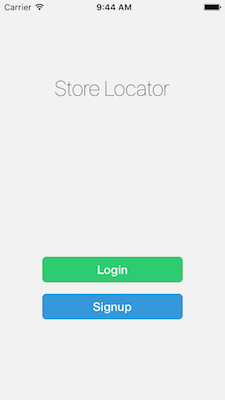

### Adding User Accounts

To add user accounts to our application, we will need to setup a login and signup route.

First we need a form component, `AccountForm`, that will be shared across our `Login` and `Signup`:

###### `app/components/AccountForm.js`

```jsx
import React, { Component } from 'react';
import { View, Text, TextInput, StyleSheet } from 'react-native'
import Button from 'react-native-button'


class AccountForm extends Component {

  constructor (props) {
    super(props)
    this.state = {
      email: '',
      password: ''
    }
  }

  onFormSubmit = () => {
    this.props.onSubmit(this.state)
  }
    
  onInputChange = (field, value) => {
    this.setState({
      ...this.state,
      ...{[field]:value}
    })
  }

  render () {
    return (
      <View style={styles.container}>

        <TextInput style={styles.input}
          placeholder='Email'
          onChangeText={(value) => this.onInputChange('email', value)}
          value={this.state.email}
          autoCapitalize='none'
          />

        <TextInput style={styles.input}
          onChangeText={(value) => this.onInputChange('password', value)}
          secureTextEntry={true}
          value={this.state.password}
          placeholder='Password'
          autoCapitalize='none'
          />

        <Button style={styles.btnText}
          containerStyle={styles.btn}
          onPress={this.onFormSubmit}>Submit
        </Button>

      </View>
    )
  }
}

var styles = StyleSheet.create({
    container: {
        flex: 1,
        justifyContent: "center",
        alignItems: "center",
        backgroundColor: "#f2f2f2"
    },
    btnText: {
        color: "#f2f2f2"
    },
    btn: {
        backgroundColor:"#333",
        padding:8,
        borderRadius:6,
        width:200
    },
    input: {
        backgroundColor: "#fff",
        textAlign:"center",
        height: 40,
        marginBottom: 10,
        padding:10
    }
});

export default AccountForm
```

Now that we have an form setup to receive user credentials, lets add a `Login` and `Signup` Component and render the `AccountForm` in each.

The `AccountForm` expects a single prop of `onSubmit` which an object containing the user entered credentials are passed to. For now we will leave this out and focus on rendering just the UI and then connect the prop to an action.

First add the `Login` component:

###### `app/components/Login.js`

```jsx
import React from 'react';
import { AccountForm } from '../components'

function Login () {
    return (
        <AccountForm />
    )
}

export default Login
```

Then the `Signup` component:

###### `app/components/Signup.js`

```jsx
import React from 'react';
import { AccountForm } from '../components'

function Signup () {
    return (
        <AccountForm />
    )
}

export default Signup
```

Great!

Next let's add these components to our `app/config/routes.js`:

###### `app/config/route.js`

```
import React from 'react';
import { View } from 'react-native';
import { Router, Scene } from 'react-native-router-flux'
import {
  Home,
  Login,
  Signup,
} from '../components/'

export default function Routes () {
  return (
    <Router>
      <Scene key="root">
        <Scene key="home" title="Home" component={Home} initial={true} hideNavBar={true} />
        <Scene key="login" title="Login" component={Login} />
        <Scene key="signup" title="Signup" component={Signup} />
      </Scene>
    </Router>
  )
}
```

Now we can see our login and signup views.

| | |
|-|-|
|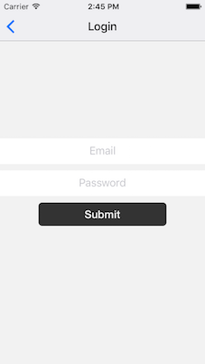|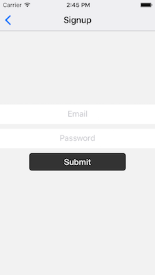|

Next let's add Redux actions and a few methods that will make our requests to Stamplay to add, and authenticate users accounts.

First, create a new application on [Stamplay](https://stamplay.com), and keep the `APP ID` handy.
Also, make sure that your development enviornment is enabled in the CORS enabled domain section in the Dashboard of the Stamplay Editor.

The `APP-ID` for this demo is `store-locator`, so be sure to replace this in the code with your own.

Inside your `app/api` folder add an `accounts.js`:

###### `app/api/accounts.js`

```javascript
import axios from 'axios'

const BASE_URI = `https://store-locator.stamplayapp.com`

export function login (credentials) {
  return axios(`${BASE_URI}/auth/v1/local/login`, {
    method: 'POST',
    data: credentials
  })
}

export function signup (credentials) {
  return axios(`${BASE_URI}/api/user/v1/users`, {
    method: 'POST',
    data: credentials
  })
}
```

Now create and `accounts.js` inside our `app/actions` directory:

###### `app/actions/accounts.js`

```javascript
import { login, signup } from '../api/accounts'

export function loginAndAuthUser (credentials) {
  return function (dispatch) {
    return login(credentials)
      .then((res) => console.log(res.data))
      .catch((err) => console.log(err))
  }
}

export function signupAndAuthUser (credentials) {
  return function (dispatch) {
    return signup(credentials)
      .then((res) => console.log(res.data))
      .catch((err) => console.log(err))
  }
}
```

For now we won't set any dispatch any Redux actions to change our state, we will just log the response to make sure we are making the request correctly. Back in our `Login` and `Signup` components we need to attach an action creator to our `AccountForm` by passing in a `onSubmit` prop.

Starting with our `Signup` component:

###### `app/component/Signup.js`

```jsx
import React from 'react';
import { AccountForm } from '../components'
import { connect } from 'react-redux'
import { bindActionCreators } from 'redux'
import { Actions } from 'react-native-router-flux'
import * as accountActionCreators from '../actions/accounts'

function Signup (props) {

  handleFormSubmit = (credentials) => {
    props.signupAndAuthUser(credentials)
      .then(() => Actions.home())
  }

  return (
    <AccountForm onSubmit={handleFormSubmit}/>
  )
}

export default connect(
  (state) => ({}),
  (dispatch) => (bindActionCreators(accountActionCreators, dispatch))
  )(Signup)
```

We can now refactor our `Login` component in the same way:

###### `app/component/Login.js`

```jsx
import React from 'react';
import { AccountForm } from '../components'
import { connect } from 'react-redux'
import { bindActionCreators } from 'redux'
import { Actions } from 'react-native-router-flux'
import * as accountActionCreators from '../actions/accounts'

function Login (props) {

  handleFormSubmit = (credentials) => {
    props.loginAndAuthUser(credentials)
      .then(() => Actions.home())
  }

  return (
    <AccountForm onSubmit={handleFormSubmit}/>
  )
}

export default connect(
  (state) => ({}),
  (dispatch) => (bindActionCreators(accountActionCreators, dispatch))
  )(Login)
```

Inside our debug console, after we submit credentials into the `Signup` form, and then our `Login`, a successful response will return:

```json
{
  "__v" : 0,
  "_id" : "5735f12bb0305bd30c5e0a88",
  "appId" : "store-locator",
  "dt_create" : "2016-05-13T15:22:19.222Z",
  "dt_update" : "2016-05-13T15:22:19.222Z",
  "email" : "isaiahgrey@gmail.com",
  "emailVerified" : true,
  "givenRole" : "572ccdd421c3a8324d19ff70",
  "id" : "5735f12bb0305bd30c5e0a88",
  "password" : "$2a$12$.rOxgM7aBkxU76Ol9n7MEOJ6sg8BF1YGKd/pPC/SluIPdssYVceR.",
  "profileImg" : "",
  "verificationCode" : "1b025d350263af8420b5"
}
```

Currently we are only logging our user data in the response, but next we will save the user session to a storage mechansim so users do not have to be re-authenticated each time.

First let's add a few methods to manage session token, and user data.

Back inside our `app/api/accounts.js`:

###### `app/api/accounts.js`

```javascript
import axios from 'axios'
import { AsyncStorage } from 'react-native'

const BASE_URI = `https://store-locator.stamplayapp.com`

export function login (credentials) {
  return axios(`${BASE_URI}/auth/v1/local/login`, {
    method: 'POST',
    data: credentials
  })
}

export function signup (credentials) {
  return axios(`${BASE_URI}/api/user/v1/users`, {
    method: 'POST',
    data: credentials
  })
}

export function setAuth ({ headers, data }) {
  AsyncStorage.setItem('stamplay-user', headers['x-stamplay-jwt'])
  return data
}

export function checkAuth () {
  return AsyncStorage.getItem('stamplay-user')
}

export function revokeAuth () {
  return AsyncStorage.removeItem('stamplay-user') 
}

export function currentUser (token) {
  if(token === null) return {}
  return axios(`${BASE_URI}/api/user/v1/getstatus`, {
    method: "GET",
    headers : {
      "x-stamplay-jwt": token,
      "Content-Type": 'application/json'
    }
  })
```

Then we can refactor `app/actions/accounts.js` to use the newly created API methods:

###### `app/actions/accounts.js`

```javascript
import {
  login,
  signup,
  setAuth
} from '../api/accounts'

function setCurrentUser (user, isAuthed = true) {
  return {
    type: 'SET_CURRENT_USER',
    user,
    isAuthed,
  }
}

export function loginAndAuthUser (credentials) {
  return function (dispatch) {
    return login(credentials)
      .then((res) => setAuth(res))
      .then((user) => dispatch(setCurrentUser(user)))
      .catch((err) => console.warn(err))
  }
}

export function signupAndAuthUser (credentials) {
  return function (dispatch) {
    return signup(credentials)
      .then((res) => setAuth(res))
      .then((user) => dispatch(setCurrentUser(user)))
      .catch((err) => console.warn(err))
  }
}
```

Now when our existing `login` and `signup` methods are triggered a user will be set in our state, and their session token to a local storage mechansim.

Next we need to handle an existing user session when the application starts, and provide options other than `Login` and `Register`.

First create a new component `UserActions` inside `app/components`:

###### `app/components/UserActions.js`

```jsx
import React from 'react'
import { View, StyleSheet } from 'react-native'
import { Actions } from 'react-native-router-flux'
import Button from 'react-native-button'

export default function UserActions (props) {
  return (
    <View style={styles.container}>
      <Button
        style={styles.btnText}
        containerStyle={[styles.btn, styles.bgGreen]}
        onPress={Actions.stores}>Stores Near Me</Button>
      <Button
        style={styles.btnText} 
        containerStyle={[styles.btn, styles.bgDark]}
        onPress={props.handleLogout}>Logout</Button>
    </View>
  )
}

var styles = StyleSheet.create({
  btnText: {
    color: "#f2f2f2"
  },
  btn: {
    width:200,
    padding:8,
    borderRadius:6,
    margin:8
  },
  bgGreen: {
    backgroundColor:"#2ecc71",
  },
  bgDark: {
    backgroundColor:"#333",
  },
  btnDisabled:{
    opacity: 0.8
  },
})
```

Then back in `app/components/Home` refactor `availableActions` to check if a parameter `isAuthed` is `true` or `false` and return the corresponding actions component. If `undefined`, return a text status indicating that it's loading.

###### `app/components/Home.js`

```jsx
import React, { Component } from 'react'
import { View, Text, StyleSheet } from 'react-native'
import { GuestActions, UserActions } from '../components'

 class Home extends Component {

  availableActions = (isAuthed) =>{
    if(isAuthed === true) return <UserActions />
    else if(isAuthed === false) return <GuestActions />
    else return <Text>Loading...</Text>
  }

  render () {
    return (
      <View style={styles.container}>
        <Text style={styles.heading}>Store Locator</Text>
        <View>
          {this.availableActions()}
        </View>
      </View>
    )   
  }
}

var styles = StyleSheet.create({
  container: {
    flex:1,
    alignItems: "center",
    justifyContent:"space-around",
    backgroundColor: '#f2f2f2',
  },
  heading: {
    fontSize: 30,
    fontWeight: "100",
  }
})

export default Home
```

Now when we refresh our app, we will see a `Loading...` status.

This would be because we never configured our reducer to handle the action of `SET_CURRENT_USER`, even though we dispatched correctly. And we also haven't even connected our `Home` component to `redux`.

So inside our reducer, `app/reducers/account.js`, let's first refactor our initial state and specify how state will change when this action occurs:

###### `app/reducers/account.js`

```javascript
const initialState = {
  user: {},
  isAuthed: undefined
}

export default function accounts (state = initialState, action) {
  switch (action.type) {
    case 'SET_CURRENT_USER' :
      return {
        ...state,
        user: action.user,
        isAuthed: action.isAuthed,
      }
    default :
      return state
  }
}
```

Next add a method to our `app/actions/accounts.js` that will fetch the current user session on application load.

###### `app/actions/accounts.js`

```javascript

import {
  login,
  signup,
  setAuth,
  checkAuth,
  currentUser
} from '../api/accounts'

function setCurrentUser (user, isAuthed = true) {
  return {
    type: 'SET_CURRENT_USER',
    user,
    isAuthed,
  }
}

export function loginAndAuthUser (credentials) {
  return function (dispatch) {
    return login(credentials)
      .then((res) => setAuth(res))
      .then((user) => dispatch(setCurrentUser(user)))
      .catch((err) => console.warn(err))
  }
}

export function signupAndAuthUser (credentials) {
  return function (dispatch) {
    return signup(credentials)
      .then((res) => setAuth(res))
      .then((user) => dispatch(setCurrentUser(user)))
      .catch((err) => console.warn(err))
  }
}

export function fetchIfCurrentUser () {
  return function (dispatch) {
    return checkAuth()
      .then((token) => currentUser(token))
      .then(({ data = {} }) => {
        if(data.user) dispatch(setCurrentUser(data.user))
        else dispatch(setCurrentUser({}, false))
      })
      .catch((err) => console.warn(err))
  }
}
```

Now back in our `Home` component we can fetch the current session on load if there is one, and render the appropriate actions for the user type, authenticated or guest.


First we connect our component to redux, bind our action creators, and map certain parts of our application state to our `Home` component props.

###### `app/components/Home.js`

```jsx
import React, { Component } from 'react'
import { View, Text, StyleSheet } from 'react-native'
import { GuestActions, UserActions } from '../components'
import { connect } from 'react-redux'
import { bindActionCreators } from 'redux'
import * as accountActions from '../actions/accounts'

 class Home extends Component {

  componentDidMount = () => {
    this.props.actions.account.fetchIfCurrentUser()
  }

  availableActions = (isAuthed) =>{
    if(isAuthed === true) return <UserActions />
    else if(isAuthed === false) return <GuestActions />
    else return <Text>Loading...</Text>
  }

  render () {
    return (
      <View style={styles.container}>
        <Text style={styles.heading}>Store Locator</Text>
        <View>
          {this.availableActions(this.props.isAuthed)}
        </View>
      </View>
    )   
  }
}

var styles = StyleSheet.create({
  container: {
    flex:1,
    alignItems: "center",
    justifyContent:"space-around",
    backgroundColor: '#f2f2f2',
  },
  heading: {
    fontSize: 30,
    fontWeight: "100",
  }
})

export default connect(
  (state) => ({
    user: state.account.user,
    isAuthed: state.account.isAuthed,
  }),
  (dispatch) => ({
    actions: {
      account: bindActionCreators(accountActions, dispatch),
    }
  })
  )(Home)
```

Now when refresh our app, we will be presented with user actions instead of login and signup as our component will fetch the current user session if there is one, and render accordingly.

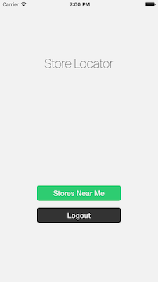

The only last thing to do now for user accounts is add a logout method.

Inside our `app/components/Home.js` add a prop to the `UserActions` component being rendered inside our `availableActions` method of `logoutAndUnauthUser()` off of our:

###### `app/components/Home.js`


```javascript
import React, { Component } from 'react'
import { View, Text, StyleSheet } from 'react-native'
import { GuestActions, UserActions } from '../components'
import { connect } from 'react-redux'
import { bindActionCreators } from 'redux'
import * as accountActions from '../actions/accounts'

 class Home extends Component {

  componentDidMount = () => {
    this.props.actions.account.fetchIfCurrentUser()
  }

  availableActions = (isAuthed) =>{
    if(isAuthed === true) return <UserActions handleLogout={this.props.actions.account.logoutAndUnauthUser} />
    else if(isAuthed === false) return <GuestActions />
    else return <Text>Loading...</Text>
  }

  render () {
    return (
      <View style={styles.container}>
        <Text style={styles.heading}>Store Locator</Text>
        <View>
          {this.availableActions(this.props.isAuthed)}
        </View>
      </View>
    )   
  }
}

var styles = StyleSheet.create({
  container: {
    flex:1,
    alignItems: "center",
    justifyContent:"space-around",
    backgroundColor: '#f2f2f2',
  },
  heading: {
    fontSize: 30,
    fontWeight: "100",
  }
})

export default connect(
  (state) => ({
    user: state.account.user,
    isAuthed: state.account.isAuthed,
  }),
  (dispatch) => ({
    actions: {
      account: bindActionCreators(accountActions, dispatch),
    }
  })
  )(Home)
```

Now that the method is setup inside our component, add it to the `actions` file for our accounts.

###### `app/actions/accounts.js`

```javascript
import {
  login,
  signup,
  setAuth,
  checkAuth,
  revokeAuth,
  currentUser
} from '../api/accounts'

function setCurrentUser (user, isAuthed = true) {
  return {
    type: 'SET_CURRENT_USER',
    user,
    isAuthed,
  }
}

function removeCurrentUser () {
  return {
    type: REMOVE_CURRENT_USER
  }
}

export function loginAndAuthUser (credentials) {
  return function (dispatch) {
    return login(credentials)
      .then((res) => setAuth(res))
      .then((user) => dispatch(setCurrentUser(user)))
      .catch((err) => console.warn(err))
  }
}

export function signupAndAuthUser (credentials) {
  return function (dispatch) {
    return signup(credentials)
      .then((res) => setAuth(res))
      .then((user) => dispatch(setCurrentUser(user)))
      .catch((err) => console.warn(err))
  }
}

export function fetchIfCurrentUser () {
  return function (dispatch) {
    return checkAuth()
      .then((token) => currentUser(token))
      .then(({ data = {} }) => {
        if(data.user) dispatch(setCurrentUser(data.user))
        else dispatch(setCurrentUser({}, false))
      })
      .catch((err) => console.warn(err))
  }
}

export function logoutAndUnauthUser () {
  return function (dispatch) {
    return revokeAuth()
      .then(() => dispatch(removeCurrentUser()))
  }
}
```

Now in our reducer, we need to add a `case` for `REMOVE_CURRENT_USER`:

###### `app/reducers/account.js`

```javascript
const initialState = {
  user: {},
  isAuthed: undefined
}

export default function accounts (state = initialState, action) {
  switch (action.type) {
    case 'SET_CURRENT_USER' :
      return {
        ...state,
        user: action.user,
        isAuthed: action.isAuthed,
      }
    case 'REMOVE_CURRENT_USER' :
      return {
        ...state,
        user: {},
        isAuthed: false,
      }
    default :
      return state
  }
}
```

Now our user accounts are in place, we can register, login, and logout. Next we will bring in geolocation to our application.

### Added Geolocation

This time we will build from our reducer to our component, instead of the other way around.

To start refactor our location reducer with an initial state and a few action cases:

###### `app/reducers/location.js`

```
const initialState = {
  position: {},
  enabled: undefined,
}

export default function location (state = initialState, action) {
  switch (action.type) {
    case 'SET_LOCATION' :
      return {
        ...state,
        position: action.position,
        enabled: true
      }
    case 'SET_LOCATION_ERROR' :
      return {
        ...state,
        enabled: false
      }
    default :
      return state
  }
}
```

###### `app/actions/location.js`

Now inside a new file, `app/actions/location.js`, add the methods that will dispatch these actions:

```javascript
function setLocation (position) {
  return {
    type: 'SET_LOCATION',
    position,
  }
}

function setLocationError (error) {
  return {
    type: 'SET_LOCATION_ERROR',
    error,
  }
}

export function getAndSetCurrentLocation () {
  return function (dispatch) {
    return navigator.geolocation.getCurrentPosition(
      ({ coords }) => dispatch(setLocation(coords)),
      ({ message }) => dispatch(setLocationError(message)),
      {
        enableHighAccuracy: true,
        timeout: 20000,
        maximumAge: 1000
      }
    )
  }
}
```

Next add a new component `Location`:

###### `app/components/Location.js`

```jsx
import React from 'react'
import { View, Text, StyleSheet } from 'react-native'

export default function Location (props) {
  if(props.enabled === false) {
    return (
      <View>
        <Text style={styles.errorMsg}
          Unable to retrieve your location
        </Text>
        <Text style={styles.errorMsg}>
          Please ensure your location is enabled.
        </Text>
      </View>
    )
  } else {
    return <View></View>
  } 
}

var styles = StyleSheet.create({
  errorMsg : {
    fontSize: 11,
    color: "#bbb",
    textAlign: "center",
  },
})
```

In our `app/components/Home` componet lets bind our location actions to props, and map our location state of `enabled` to props:

```jsx
import React, { Component } from 'react'
import { View, Text, StyleSheet } from 'react-native'
import { GuestActions, UserActions, Location } from '../components'
import { connect } from 'react-redux'
import { bindActionCreators } from 'redux'
import * as accountActions from '../actions/accounts'
import * as locationActions from '../actions/location'

 class Home extends Component {

  componentDidMount = () => {
    this.props.actions.account.fetchIfCurrentUser()
    this.props.actions.location.getAndSetCurrentLocation()
  }

  availableActions = (isAuthed) => {
    if(isAuthed === true) return <UserActions handleLogout={this.props.actions.account.logoutAndUnauthUser} />
    else if(isAuthed === false) return <GuestActions />
    else return <Text>Loading...</Text>
  }

  render () {
    return (
      <View style={styles.container}>
        <Text style={styles.heading}>Store Locator</Text>
        <View>
          {this.availableActions(this.props.isAuthed)}
        </View>
        <Location enabled={this.props.locationEnabled} />
      </View>
    )   
  }
}

var styles = StyleSheet.create({
  container: {
    flex:1,
    alignItems: "center",
    justifyContent:"space-around",
    backgroundColor: '#f2f2f2',
  },
  heading: {
    fontSize: 30,
    fontWeight: "100",
  }
})

export default connect(
  (state) => ({
    user: state.account.user,
    isAuthed: state.account.isAuthed,
    locationEnabled: state.location.enabled
  }),
  (dispatch) => ({
    actions: {
      account: bindActionCreators(accountActions, dispatch),
      location: bindActionCreators(locationActions, dispatch),
    }
  })
  )(Home)
```

Now when we reload our application, we should be prompted to enabled our location. If we select no, you'll notice that an error message will appear at the bottom of our `Home` state as seen below.

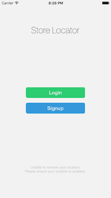

To re-enabled device location, if you've selected to not allow, then you will need to go to the decice **Settings > Privacy > Location Services** select your app and enabled **While Using** for your app.

### Listing/Filtering Store Locations

Stamplay allow's a simple way to add complex data models with geolocation data that are fully queryable.

To add our `store` model, head to the Stamplay editor for the Stamplay application tied to this mobile app, and inside the **Objects** section, add a new schema.

Upon creation, an API endpoint is generated at: `https://[APP_ID].stamplayapp.com/api/object/v1/[object-name]`.

The schema will have three properties by default:

- `owner` (The user `_id` who created this object)
- `dt_create` (Date ISO of when this object was created)
- `dt_updated` (Date ISO of when this object was last updated)

We will add `name` as a *String*, and a *Geolocation* field(the name for this field is automatically set as `_geolocation`) :

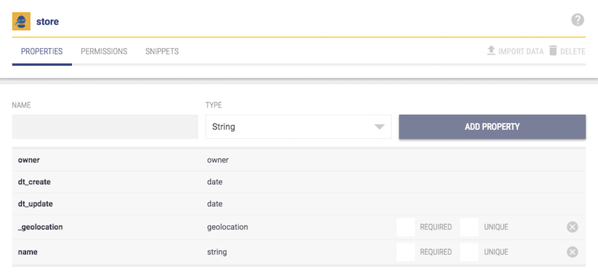

To seed `stores`, you can use the **API Console**.

Inside the API console, select the action you wish to take(i.e, Create **Object**).

Select the instance type, **store**, and enter the data for each field.

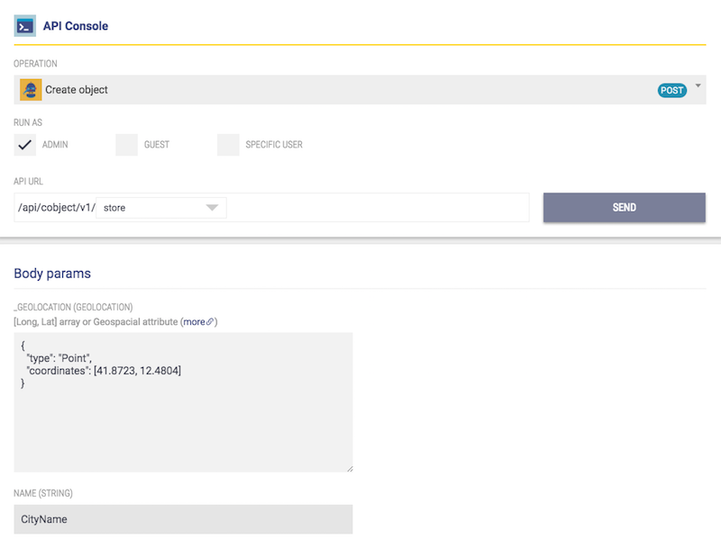

Now that we have some sample data stored, we can interact with this data inside our React Native app.

To start lets add a new component, `StoreList` to our `app/components` folder.

###### `app/components/StoreList.js`

```jsx
import React, { Component } from 'react';
import { ScrollView, StyleSheet } from 'react-native'

class StoreList extends Component {
  render () {
    return (
      <ScrollView style={styles.container} contentContainerStyle={styles.contentContainer}>

      </ScrollView>
    )
  }
}

var styles = StyleSheet.create({
  container: {
    flex: 1,
    marginTop:64,
    backgroundColor: '#fdfdfd',
  },
  contentContainer : {
    justifyContent: "flex-start",
    alignItems: "stretch",
  },

})

export default StoreList
```

Add a new route inside `app/config/routes`:

###### `app/config/routes.js`

```jsx
import React from 'react';
import { View } from 'react-native';
import { Router, Scene } from 'react-native-router-flux'
import {
  Home,
  Login,
  Signup,
  StoreList
} from '../components/'

export default function Routes () {
  return (
    <Router>
      <Scene key="root">
        <Scene key="home" title="Home" component={Home} initial={true} hideNavBar={true} />
        <Scene key="login" title="Login" component={Login} />
        <Scene key="signup" title="Signup" component={Signup} />
        <Scene key="stores" title="Stores Near Me" component={StoreList} />
      </Scene>
    </Router>
  )
}
```

Now let's add some API method for interacting with Stamplay.

Inside your `app/api` folder, add a new file as `stores.js`:

###### `app/api/stores.js`

```javascript
import axios from 'axios'

const BASE_URI = `https://store-locator.stamplayapp.com`
const metersPerMile = 1609.344

export function fetchStores ({ longitude, latitude }, distance = 500) {
  if(distance.length === 0) distance = 500
  let query = JSON.stringify({
    "_geolocation" : {
      "$near" : {
        "$geometry": {
          "type": "Point",
          "coordinates": [longitude, latitude]
        },
        "$maxDistance" : metersPerMile * distance,
        "$minDistance" : 0
      }
    }
  })
  return axios(`${BASE_URI}/api/cobject/v1/store?where=${query}`)
}
```

Next create the actions that will be used to dispatch actions to our store reducer.

###### `app/actions/stores.js`

```javascript
import RNGeocoder from 'react-native-geocoder'
import { fetchStores } from '../api/stores'

function setStores (stores) {
  return {
    type: 'SET_STORES',
    stores,
  }
}

function setCurrent (current) {
  return {
    type: 'SET_CURRENT',
    current,
  }
}

function geocodeCoordinates (coordinates) {
  return new Promise((resolve, reject) => {
    RNGeocoder.reverseGeocodeLocation({
      longitude: coordinates[0],
      latitude: coordinates[1]
    }, function(err, [data, ...rest]) {
      if(err) reject(err)
      else resolve(data)
    })
  }) 
}

export function fetchAndSetStores (distance) {
  return function (dispatch, getState) {
    return fetchStores(getState().location.position, distance)
      .then((res) => dispatch(setStores(res.data.data)))
      .catch((err) => console.log(err))
  }
}

export function setCurrentStore (store) {
  let coordinates = store._geolocation.coordinates
  return function (dispatch, getState) {
    return geocodeCoordinates(coordinates)
      .then((address) => store.address = address)
      .then(() => dispatch(setCurrent(store)))
      .catch((err) => console.log(err))
  }
}
```

Finally, let's setup our `store` reducer to handle these action types:

###### `app/reducers/store.js`

```javascript
const initialState = {
  locations: [],
  current: {}
}

export default function store (state = initialState, action) {
  switch (action.type) {
    case 'SET_STORES' :
      return {
        ...state,
        locations :action.stores
      }
    case 'SET_CURRENT' :
      return {
        ...state,
        current: action.current,
      }
    default :
      return state
  }
}
```

Now that we have our store and reducer setup, we can add our work on adding each component to our `StoreList`.

Back inside `StoreList.js` connect `redux` and bind the store actions to props, and map the store locations to our component props.

###### `app/components/StoreList.js`

```jsx
import React, { Component } from 'react';
import { ScrollView, View, Text, StyleSheet } from 'react-native'
import { bindActionCreators } from 'redux'
import { connect } from 'react-redux'
import * as storeActions from '../actions/stores'

class StoreList extends Component {
  constructor() {
    super()
    this.state = {
      distance: 500,
      storeCount: "Loading"
    }
  }

  componentDidMount = () => {
    this.props.fetchAndSetStores(this.state.distance)
      .then(() => this.setState({
        ...this.state,
        storeCount:this.props.stores.length
      }))
  }

  render () {
    return (
      <ScrollView style={styles.container} contentContainerStyle={styles.contentContainer}>

      </ScrollView>
    )
  }
}

var styles = StyleSheet.create({
  container: {
    flex: 1,
    marginTop:64,
    backgroundColor: '#fdfdfd',
  },
  contentContainer : {
    justifyContent: "flex-start",
    alignItems: "stretch",
  },

})

export default connect(
  (state) => ({ stores: state.store.locations }),
  (dispatch) => (bindActionCreators(storeActions, dispatch))
  )(StoreList)
```

Now inside our `StoreList` on mount of our component we are fetching our stores from Stamplay, and setting the count of stores to the state. If we were to log this state property, we would be shown how many store locations are within 500 miles.

Next we will render each store found within the distance parameter.

###### `app/components/StoreListItem.js`

```jsx
import React from 'react'
import { StyleSheet, Text, TouchableOpacity } from 'react-native'

export default function StoreListItem (props) {
  return (
    <TouchableOpacity
      key={props.idx} 
      style={styles.item}
      onPress={props.handlePress.bind(null, props.store)}>
      <Text style={styles.itemTxt}>{props.store.name}</Text>
    </TouchableOpacity>
  )
}
var styles = StyleSheet.create({
  item : {
    padding:15,
    borderBottomColor:"#eee",
    backgroundColor:"#fafafa",
    borderBottomWidth:1
  },
  itemTxt: {
    color:"#666",
    textAlign:"center",
  }
})
```

Then use the new component inside our `StoreList`

###### `app/components/StoreList.js`

```jsx
import React, { Component } from 'react';
import { ScrollView, View, Text, StyleSheet } from 'react-native'
import { bindActionCreators } from 'redux'
import { connect } from 'react-redux'
import * as storeActions from '../actions/stores'
import { Actions } from 'react-native-router-flux'
import { StoreListItem } from '../components'

class StoreList extends Component {
  constructor() {
    super()
    this.state = {
      distance: 500,
      storeCount: "Loading"
    }
  }

  componentDidMount = () => {
    this.props.fetchAndSetStores(this.state.distance)
      .then(() => this.setState({
        ...this.state,
        storeCount:this.props.stores.length
      }))
  }

  onStoreSelect = (store) => {
    this.props.setCurrentStore(store)
      .then(() => Actions.details())  
      .catch(() => alert("Opps, something didn't work correctly! Try again."))
  }

  render () {
    return (
      <ScrollView style={styles.container} contentContainerStyle={styles.contentContainer}>
        {this.props.stores.map((store, idx) => {
          return (
            <StoreListItem
              key={idx}
              store={store}
              handlePress={this.onStoreSelect}
            />
          )
        })}
      </ScrollView>
    )
  }
}

var styles = StyleSheet.create({
  container: {
    flex: 1,
    marginTop:64,
    backgroundColor: '#fdfdfd',
  },
  contentContainer : {
    justifyContent: "flex-start",
    alignItems: "stretch",
  },

})

export default connect(
  (state) => ({ stores: state.store.locations }),
  (dispatch) => (bindActionCreators(storeActions, dispatch))
  )(StoreList)
```

Now when we go to Stores Near Me, we will see any stores found within 500 miles.

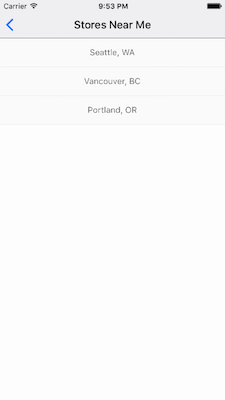

Next we will add a search parameter, to filter by distance greater or nearer than 500 miles.

Create a new component, `StoreSearch` inside `app/components`:

###### `app/components/StoreSearch.js`

```jsx
import React from 'react'
import { View, Text, TextInput, StyleSheet } from 'react-native'

export default function StoreSearch (props) {
  return (
    <View>
      <TextInput
        placeholder={'Enter a search radius for stores.'}
        style={styles.input}
        onChangeText={props.handleInputChange} />
      <Text style={styles.storeCount}>
        {props.storeCount} stores found within {props.distance || 500} miles.
      </Text>
    </View>
  )
}

var styles = StyleSheet.create({
  input : {
    height: 30,
    backgroundColor: '#fdfdfd',
    fontSize: 12,
    textAlign:"center"
  },
  storeCount : {
    textAlign:"center",
    backgroundColor:"#34495e",
    color:"#eee",
    fontSize:10,
    padding:5,
  }
})
```

Now let's add our new component inside of our `StoreList` component:

###### `app/components/StoreList.js`

```jsx
import React, { Component } from 'react';
import { ScrollView, View, Text, StyleSheet } from 'react-native'
import { bindActionCreators } from 'redux'
import { connect } from 'react-redux'
import * as storeActions from '../actions/stores'
import { Actions } from 'react-native-router-flux'
import { StoreListItem, StoreSearch } from '../components'

class StoreList extends Component {
  constructor() {
    super()
    this.state = {
      distance: 500,
      storeCount: "Loading"
    }
  }

  componentWillMount = () => {
    this.props.fetchAndSetStores(this.state.distance)
      .then(() => this.setState({
        ...this.state,
        storeCount:this.props.stores.length
      }))
  }

  onStoreSelect = (store) => {
    // set current store and navigate
  }

  onUpdateDistance = (distance) => {
    this.setState({
      ...this.state,
      storeCount: "Loading"
    })
    this.props.fetchAndSetStores(distance)
      .then(() => this.setState({
        ...this.state,
        distance,
        storeCount:this.props.stores.length
      })) 
  }

  render () {
    return (
      <ScrollView style={styles.container} contentContainerStyle={styles.contentContainer}>
        <StoreSearch
          handleInputChange={this.onUpdateDistance}
          storeCount={this.state.storeCount}
          distance={this.state.distance} />
        {this.props.stores.map((store, idx) => {
          return (
            <StoreListItem
              key={idx}
              store={store}
              handlePress={this.onStoreSelect}
            />
          )
        })}
      </ScrollView>
    )
  }
}

var styles = StyleSheet.create({
  container: {
    flex: 1,
    marginTop:64,
    backgroundColor: '#fdfdfd',
  },
  contentContainer : {
    justifyContent: "flex-start",
    alignItems: "stretch",
  },

})

export default connect(
  (state) => ({ stores: state.store.locations }),
  (dispatch) => (bindActionCreators(storeActions, dispatch))
  )(StoreList)
```

Now when our view renders we can enter a number of miles we would like to see stores within.

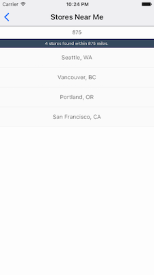

### Store Details View

Now that we have a list of stores with `x` amount of miles, we can allow users to select a store and view details regarding that location.

To start, create a new component, `Store`:

###### `app/components/Store.js`

```jsx
import React, { Component } from 'react';
import { View, Text, StyleSheet } from 'react-native'
import { connect } from 'react-redux'
import { bindActionCreators } from 'redux'
import { Actions } from 'react-native-router-flux'
import * as storeActions from '../actions/stores'
import Button from 'react-native-button'
import { StoreMap, StoreDetails } from '../components'

class Store extends Component {
  constructor () {
    super()
    this.state = {
      region :{
        latitude: 37.78825, longitude: -122.4324,
        latitudeDelta: 0.0055, longitudeDelta: 0.008
      },
      coordinate : {
        latitude: 37.78825, longitude: -122.4324,
      }
    }
  }

  componentDidMount = () => {
    let region = this.props.region.coordinates
    this.setState({
      ...this.state,
      region : {
        ...this.state.region,
        longitude: region[0],
        latitude: region[1]
      },
      url: `http://maps.apple.com/?ll=${region[1]},${region[0]}`
    })
  }

  render () {
    return (
      <View style={styles.container}>
          <StoreMap
            storeRegion={this.state.region}
            markerCoords={this.state.region}
            markerTitle={this.props.store.name} />
          <StoreDetails storeAddress={this.props.address} mapsUrl={this.state.url}/>
      </View>
    )
  }
}


var styles = StyleSheet.create({
  container:{
    flex:1,
    marginTop:64,
  }
})

export default connect(
  (state) => ({
    region: state.store.current._geolocation,
    address: state.store.current.address,
    store: state.store.current
  })
)(Store)
```

Next we will create the two components being rendered inside our `Store` component.

Add a new component `StoreMap`:

###### `app/components/StoreMap.js`

```jsx
import React from 'react'
import { StyleSheet, Dimensions } from 'react-native'
import MapView, { Marker } from 'react-native-maps'

export default function StoreMap (props) {
  return (
    <MapView style={styles.map} region={props.storeRegion}>
      <Marker coordinate={props.markerCoords} title={props.markerTitle}/>
    </MapView>
  )
}

let {height, width} = Dimensions.get('window')

var styles = StyleSheet.create({
  map :{
    width:width,
    height:height / 2
  },
})
```

And now a `StoreDetails` component:

```jsx
import React from 'react'
import { StyleSheet, View, Text, Linking, Dimensions } from 'react-native'
import Button from 'react-native-button'

export default function StoreDetails (props) {

  handleClick = () => {
    Linking.openURL(props.mapsUrl)
  }

 return (
  <View style={styles.detailsContainer}>
    <View style={styles.btnContainer}>
      <Button style={styles.btn} onPress={handleClick}>Get Directions</Button>
    </View>
    <View style={styles.addressContainer}>
      <Text style={styles.addressLine}>{props.storeAddress.name}</Text>
      <Text style={styles.addressLine}>{props.storeAddress.locality}, {props.storeAddress.administrativeArea}</Text>
      <Text style={styles.addressLine}>{props.storeAddress.country}</Text>
    </View>
  </View>
 )

}

let {height, width} = Dimensions.get('window')

var styles = StyleSheet.create({
  detailsContainer : {
    flex: 1,
    justifyContent: "space-between",
    backgroundColor:"#fafafa",
  },
  btnContainer: {
    width:width
  },
  btn: {
    padding:30
  },
  addressContainer: {
    backgroundColor:"#fff",
    width:width,
    paddingTop:20,
    paddingBottom:20,
  },
  addressLine: {
    textAlign:"center",

  }
})
```

Now lastly add a new route to our `app/config/routes.js`

```jsx
import React from 'react';
import { View } from 'react-native';
import { Router, Scene } from 'react-native-router-flux'
import {
  Home,
  Login,
  Signup,
  StoreList,
  Store
} from '../components/'

export default function Routes () {
  return (
    <Router>
      <Scene key="root">
        <Scene key="home" title="Home" component={Home} initial={true} hideNavBar={true} />
        <Scene key="login" title="Login" component={Login} />
        <Scene key="signup" title="Signup" component={Signup} />
        <Scene key="stores" title="Stores Near Me" component={StoreList} />
        <Scene key="details" title="Details" component={Store} />
      </Scene>
    </Router>
  )
}
```

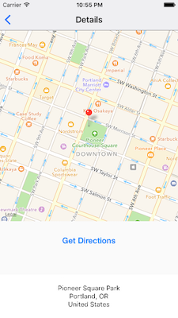

Our mobile application now allows users to filter through locations by distance to them, and view details about each location.


### You've done it.

Well done! You've built a React Native application!

Now there is plenty of time to celebrate, but there are still many features and improvements that could be made to our application.

One thing that comes to mind is [Prop Validation](https://facebook.github.io/react/docs/reusable-components.html#prop-validation) for our components. 

Adding prop validation with `React.PropTypes` to your components will allow for better debugging, and maintainability. I've only left them off in effort to be concise.

React, React Native, Redux and the ecosystem of it all can be overwhelming at times, but in my experience my developer experience using React has been much better than other experiences I've had with frontend stacks.

If you are looking to level up in a big way, I would take a deep dive [React.js Program](http://www.reactjsprogram.com/). The course is a modular, linear approach from [Tyler Mcginnis](https://twitter.com/tylermcginnis33), who is an excellent instructor.

It is by far my favorite course so far.

Thank you for sticking with me this far, and I hope you learned a thing or two, and you were amazed by the power and ease of using Stamplay as a backend application, and how cool React is!

Cheers!


